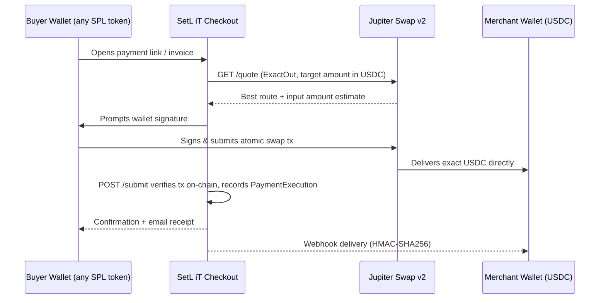
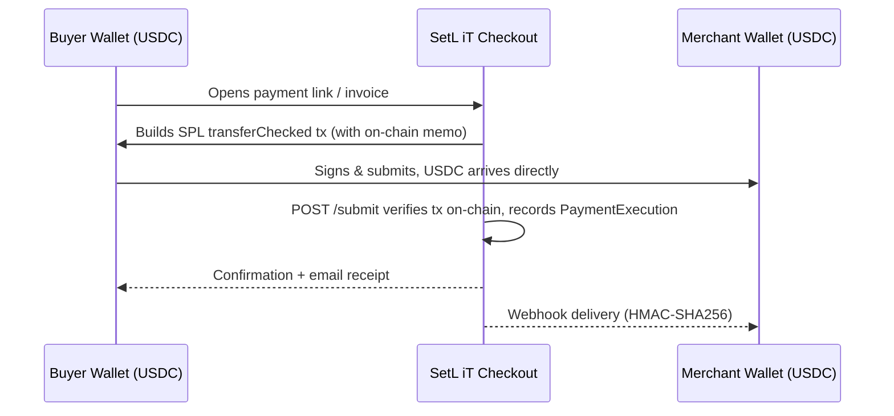

# SetLiT

Non-custodial Solana payment infrastructure for merchants and creators.

SetL iT lets merchants generate payment links, invoices, and subscriptions that accept any SPL token. Buyers pay with whatever they're holding, and merchants receive the exact USDC amount they asked for, settled wallet to wallet in under a second through Jupiter's ExactOut swap.

Built for the [Colosseum Frontier 2026 Hackathon](https://colosseum.org), Payments & Remittance track.

## The problem

- Centralized gateways (Stripe, PayPal, Coinbase Commerce) charge 2-3% and can freeze accounts or delay payouts.
- If a merchant wants USDC but the buyer only holds BONK or SOL, the sale dies. The buyer has to leave, swap manually, and come back.
- Coinbase Commerce shut down on March 31 2026 and left international merchants without a replacement. Its successor covers the US and Singapore only.

## How SetL iT solves it

- Funds move straight from the buyer's wallet to the merchant's wallet. SetL iT never holds anything.
- Jupiter's ExactOut swap API atomically converts the buyer's token and delivers the precise amount the merchant requested.
- There's no platform fee. The only cost is the Solana network fee, around $0.00025.
- Solana finalizes in under a second, so there are no payout delays or holds.

## Payment flow

### Jupiter swap path (buyer pays a different token)



### Direct settlement path (buyer pays USDC directly)



Both paths converge at `lib/services/payment-submit.service.ts`, which verifies the transaction on-chain, upserts a `PaymentExecution` record (idempotent on `clientExecutionId`), fires the merchant webhook, and sends email receipts.

## Features

| Feature                | Details                                                  |
| ---------------------- | -------------------------------------------------------- |
| Payment links          | Fixed-amount or open-amount, shareable URL               |
| Invoices               | One-off requests with due dates and line items           |
| Subscriptions          | Daily or weekly recurring billing via relayer keypair    |
| Split payments         | Up to 10 recipients, basis-point allocation              |
| Solana Pay QR          | Native QR code flow via Solana Pay spec                  |
| Embeddable widget      | Drop-in `<script>` tag, iframe checkout (`/embed/[id]`)  |
| REST API               | Full programmatic access, bearer token auth              |
| API keys               | SHA-256 hashed at rest, accepted on all routes           |
| HMAC webhooks          | `X-SetLiT-Signature: sha256=…` on every payment event   |
| Merchant personal page | Open-amount transfers at `/pay/u/[merchantId]`           |
| Dashboard              | Payment history, stats, revenue charts                   |
| Email receipts         | Buyer and merchant notifications via Resend              |

## Tech stack

| Layer           | Technology                                                    |
| --------------- | ------------------------------------------------------------- |
| Framework       | Next.js 16 (App Router), React 19                             |
| Styling         | Tailwind CSS v4, shadcn/ui, Radix UI                          |
| Animation       | Motion (Framer Motion v12)                                    |
| Icons           | Phosphor Icons, Lucide                                        |
| Charts          | Recharts                                                      |
| ORM             | Prisma 7 (`@prisma/adapter-pg`)                               |
| Database        | PostgreSQL (Aiven)                                            |
| Auth            | Ed25519 wallet signature to HS256 JWT (jose), httpOnly cookie |
| Web3            | `@solana/web3.js`, `@solana/spl-token`, Wallet Adapter        |
| Swaps           | Jupiter Swap v2 (`swapMode=ExactOut`)                         |
| Email           | Resend                                                        |
| Validation      | Zod                                                           |
| Package manager | Bun                                                           |

## Architecture

### Route groups

- `(pay)/` is public and buyer-facing: landing, payment link checkout (`/pay/[id]`), invoice (`/invoice/[id]`), subscription signup (`/subscribe/[id]`), merchant personal page (`/pay/u/[merchantId]`), and docs.
- `(site)/` is the authenticated merchant dashboard (`/dashboard/*`) and wallet auth (`/auth`).
- `embed/[id]/` is a stripped iframe for the embeddable checkout widget.
- `api/` holds every API route. Auth is handled per route by `requireAuth` or `requireSession`.

### Authentication

Two layers share the same `requireAuth(req)` call.

Session cookie: the client signs a nonce with their Solana wallet, the server verifies the Ed25519 signature, and the response sets a 24-hour HS256 JWT as the `setlit_session` httpOnly cookie.

Bearer API key: `Authorization: Bearer <key>`. The key is SHA-256 hashed and looked up in the `ApiKey` table. It takes priority over the session cookie.

### Key invariants

- `PaymentExecution.clientExecutionId` is the idempotency key, so the submit endpoint is safe to retry.
- `PaymentExecution` uses `onDelete: Restrict` on every parent relation. Payment records are permanent proof and cannot be deleted.
- `SplitRecipient.basisPoints` must sum to 10000 across all recipients.
- Subscription renewals run daily or weekly, never monthly. The relayer keypair has to be pre-authorized by the subscriber.

## Getting started

### Prerequisites

- [Bun](https://bun.sh) ≥ 1.2
- PostgreSQL database
- Solana RPC endpoint (e.g. Helius)
- Jupiter API key

### Setup

```bash
# Install dependencies
bun install

# Copy and fill environment variables
cp .env.example .env.local

# Generate Prisma client
bun run db:generate

# Apply schema
bun run db:push

# (Optional) Seed demo data
bun run db:seed

# Start dev server
bun dev

# Run tests
bun test
```

### Environment variables

| Variable                            | Purpose                                             |
| ----------------------------------- | --------------------------------------------------- |
| `DATABASE_URL`                      | PostgreSQL connection string                        |
| `NEXT_PUBLIC_SOLANA_NETWORK`        | `mainnet-beta` or `devnet`                          |
| `NEXT_PUBLIC_SOLANA_RPC_URL`        | Client-side RPC endpoint                            |
| `SOLANA_RPC_URL`                    | Server-side RPC endpoint                            |
| `JUPITER_API_KEY`                   | Jupiter Swap v2 API key                             |
| `AUTH_SECRET`                       | JWT signing secret (`openssl rand -base64 32`)      |
| `RESEND_API_KEY`                    | Transactional email                                 |
| `SUBSCRIPTION_RELAYER_KEYPAIR_JSON` | Hot wallet keypair JSON for subscription renewals   |
| `CRON_SECRET`                       | Shared secret for `POST /api/cron/process-renewals` |

## License

MIT, Copyright (c) 2026 SetL iT
